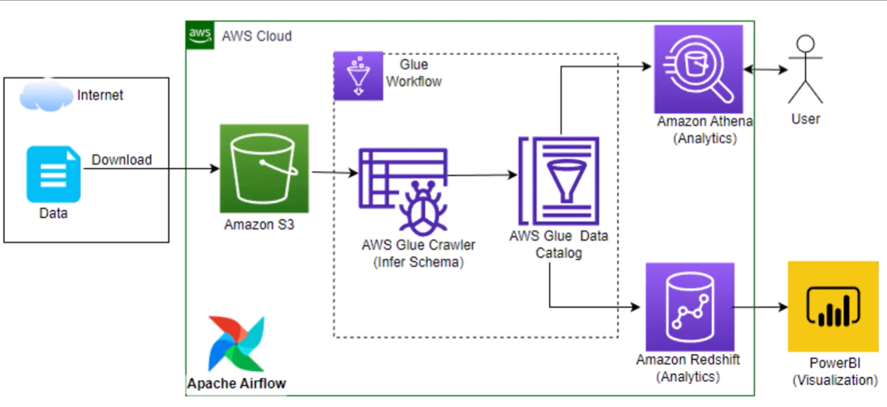

## Customer Churn Analytics with Airflow, AWS Glue & Redshift

### 📌 Project Overview
This project implements an end-to-end data pipeline for customer churn analytics using cloud-based technologies. It extracts, transforms, and loads (ETL) data from various sources into AWS Redshift and enables advanced analytics using Athena and Power BI. The pipeline is orchestrated using Apache Airflow for automated workflows.

### Architecture 


## Dataset Original Source
You can use any dataset, we are mainly interested in operation side of Data Engineering (building data pipeline) 
Here is the dataset used in the project - https://www.kaggle.com/datasets/yeanzc/telco-customer-churn-ibm-dataset?resource=download

### 🚀 Tech Stack
- **Apache Airflow** – Workflow orchestration
- **AWS Glue** – Serverless ETL processing
- **Amazon S3** – Data storage
- **Amazon Redshift** – Data warehousing
- **AWS Athena** – Querying S3 data
- **Power BI** – Data visualization

### 📊 Architecture Workflow
1. **Data Ingestion**: Raw customer data is stored in Amazon S3.
2. **ETL with AWS Glue**: Data transformation and cleaning.
3. **Loading into Redshift**: Processed data is stored in Amazon Redshift.
4. **Querying with Athena**: Enables SQL-based analysis over S3.
5. **Visualization with Power BI**: Insights on churn trends and customer retention strategies.
6. **Orchestration with Airflow**: Automates the ETL workflow.

### 🔹 Key Features
- Automated data ingestion and processing
- Scalable and serverless ETL with AWS Glue
- High-performance querying with Redshift and Athena
- Interactive dashboards in Power BI
- Scheduled pipeline execution with Airflow

### 📂 Project Structure
```
├── dags/                 # Apache Airflow DAGs for orchestration
├── scripts/              # Python scripts for ETL tasks
├── glue_jobs/            # AWS Glue ETL scripts
├── data/                 # Sample datasets
├── dashboards/           # Power BI reports
├── README.md             # Project documentation
```

### 🛠 Setup Instructions
#### Prerequisites
- AWS Account
- Apache Airflow installed
- AWS Glue, Redshift, and S3 configured
- Power BI installed for visualization

#### Steps to Run
1. Clone the repository:
   ```bash
   git clone https://github.com/Siva-Sanam/CustomerChurn_Analytics_with_Airflow-AWSGlue_Redshift.git
   ```
2. Configure AWS credentials in Airflow.
3. Upload raw customer data to S3.
4. Deploy AWS Glue jobs for ETL.
5. Run Airflow DAGs to automate the pipeline.
6. Connect Power BI to Redshift/Athena for analytics.

### 📈 Insights & Use Cases
- Identify customers at risk of churning
- Analyze retention strategies
- Predict churn probability using data trends


